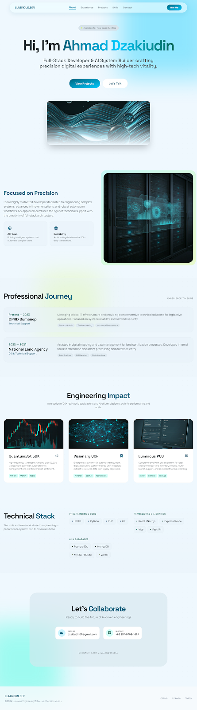

# Ahmad Dzakiudin — Ahmad Dzakiudin's Portfolio

<div align="center">



</div>
Welcome to the **Ahmad Dzakiudin Portfolio**, a highly interactive, performance-optimized, and visually stunning digital resume powered by **React**, **Vite**, and **GSAP**. Designed with a "Premium Frutiger Aero / Tech" aesthetic, this portfolio showcases a cinematic scrolling experience tailored to highlight expertise in Full-Stack Development and AI Systems Architecture.

## ✨ Key Features

- **Cinematic Smooth Scroll**: Fully integrated with Lenis for an "Awwwards-style" premium scroll feel, enhancing visual continuity.
- **Scroll-Triggered Animations**: Powered by GSAP 3 (ScrollTrigger and Timeline), every element gracefully reveals itself based on the viewport position.
- **Mobile-First Responsive Design**: Optimized meticulously for any screen size. Contains a sleek, app-like glassmorphism Mobile Menu for compact navigation.
- **Dynamic Glassmorphism UI**: High-end styling mixing Tailwind CSS v4 natively with backdrop-blurs, glowing orbs, and tech-grids for a futuristic feel.
- **Performance Optimized**: GPU-accelerated 3D transforms (`force3D`), scrub tuning, and strict overflow containments ensure butter-smooth framerates even on low-end mobile devices.

## 🛠️ Tech Stack
- **React 19**
- **Vite** (Fast Build Tooling)
- **Tailwind CSS v4** (Design System & Rapid Styling)
- **GSAP & ScrollTrigger** (Animation Engine)
- **Lenis** (Smooth Scrolling Physics)

## 🚀 Getting Started

### Prerequisites
Make sure you have [Node.js](https://nodejs.org/) installed on your machine.

### Installation & Run

1. **Clone the repository**
   ```bash
   git clone https://github.com/Dzakiudin/portfolio.git
   cd portfolio
   ```

2. **Install dependencies**
   ```bash
   npm install
   ```

3. **Start the development server**
   ```bash
   npm run dev
   ```
   Navigate to `http://localhost:5173/` in your browser.

4. **Build for Production**
   ```bash
   npm run build
   ```
   This will generate a highly optimized bundle in the `dist` directory, ready to be deployed to Vercel, Netlify, or Hostinger.

## 📁 Repository Structure

```
src/
├── components/          # Reusable UI elements (Navbar, Footer, BackgroundOrbs)
├── sections/            # Core page sections (Hero, About, Projects, etc.)
├── hooks/               # Custom React Hooks (useLenis, useActiveSection)
├── index.css            # Root Tailwind style, animations, and design tokens
├── App.jsx              # Main Entry / Root Layout Container
```

## 💎 Design System Attributes
The UI logic strictly isolates GSAP transform computations from CSS hover transitions to prevent render lag loops. It uses a custom **Luminous Theme** relying gracefully on standard Tailwind classes. The global containment system uses a strict overflow bounds policy, granting pixel-perfect layout preservation across Safari and Chrome mobile environments.

---

> Engineered with a passion for precision and scalability. Built by **Ahmad Dzakiudin**. Let's Collaborate!
